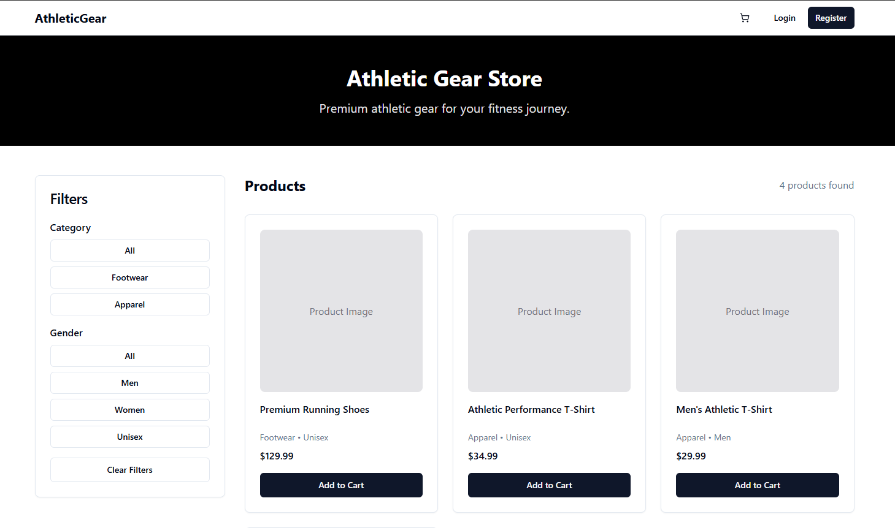
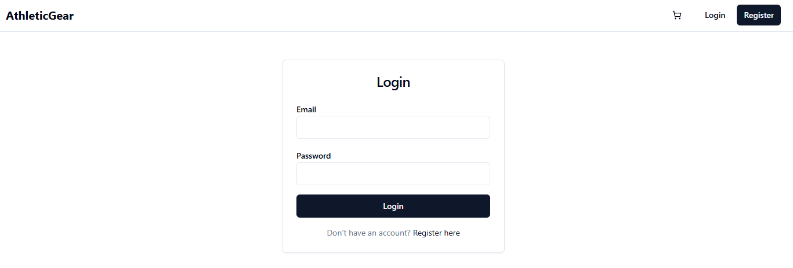
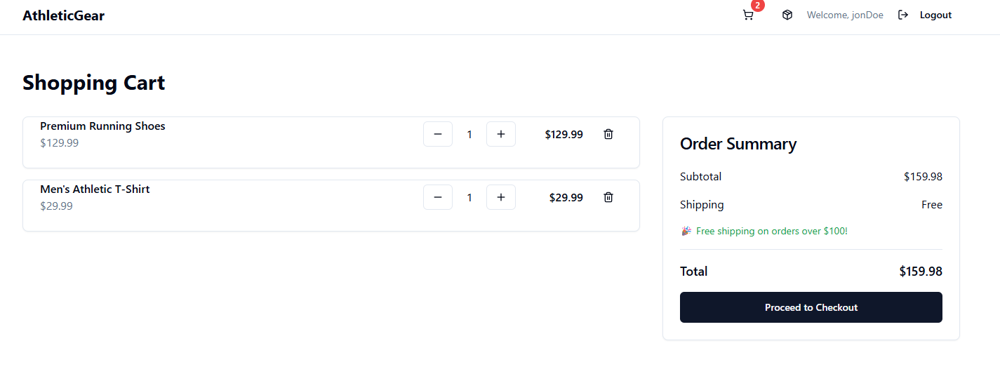
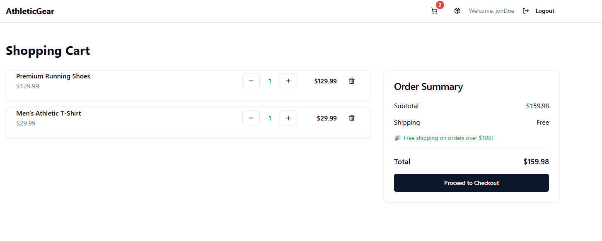
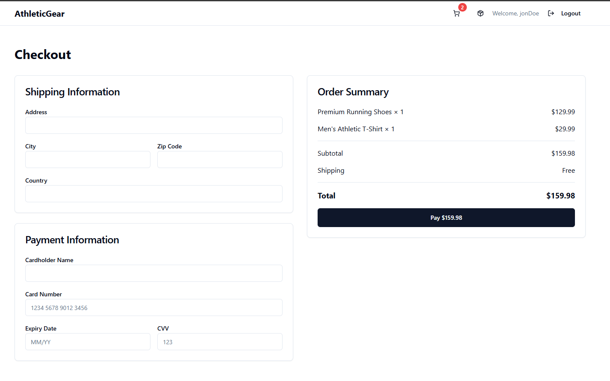

# Athletic Gear Web Application
This is a web application designed to help users find and purchase athletic gear. It features a user-friendly interface, product listings, and a shopping cart functionality.

# Features
- User authentication (sign up, login, logout)
- Product listings with search and filter options
- Shopping cart functionality
- Order history and tracking
- Responsive design for mobile and desktop devices

# Technologies Used
- Frontend: HTML, CSS, JavaScript, React
- Backend: Node.js, Express

# How to start this React Web application
- Ensure you have downloaded node js 
- run the following commands to ensure your install was successful:
<ol>
    <li>npm --version</li>
    <li>node -v</li>
</ol>
- run the following command to run updates:
<ol>
    <li>npm intall</li>
</ol>
- run the following command to start the application
<ol>
    <li>npm run dev</li>
    <li>you should get some local host url: <strong style="color:rgb(0,255,255)">http://localhost:8080/</strong> to view application</li>
</ol>

# Athletic Gear UI Images
- **Main Page**
 

 
 

- **Login Page**
 

 
 

- **Logged in as Jon Doe with two items in cart**
 

 
 

- **Order Summary as Jon Doe with two items**
 

 
 

- **Checking out as Jon Doe with two items**
 

